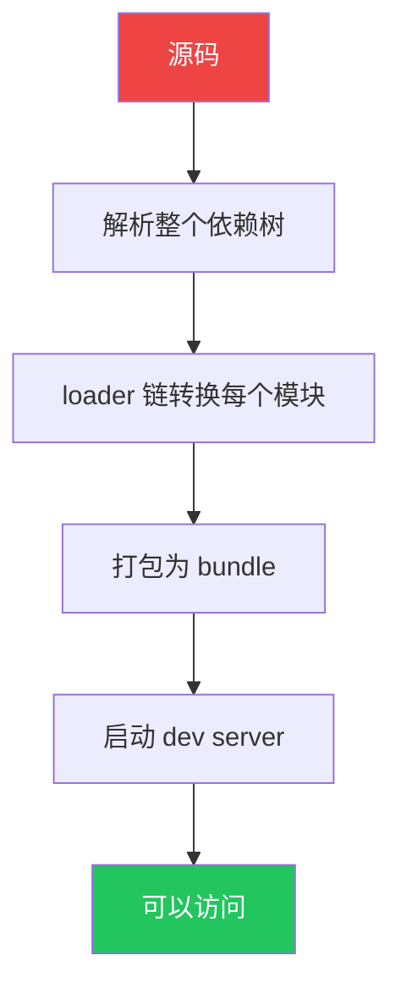
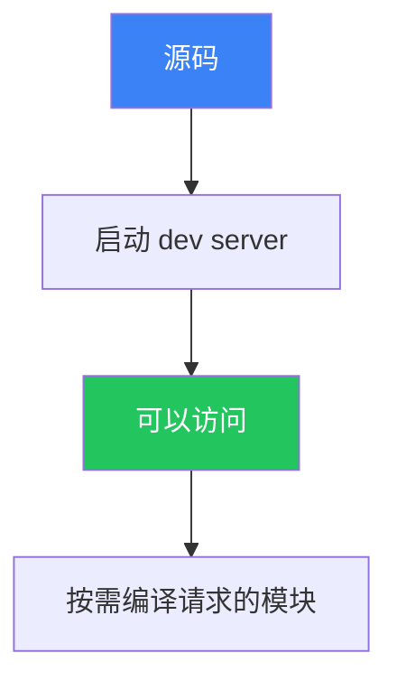
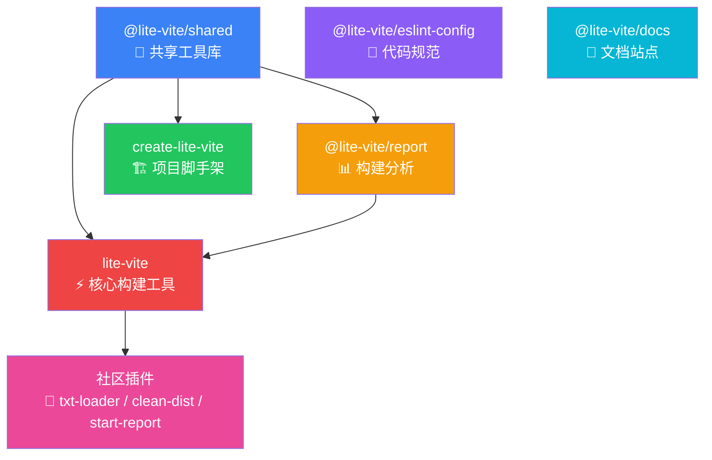
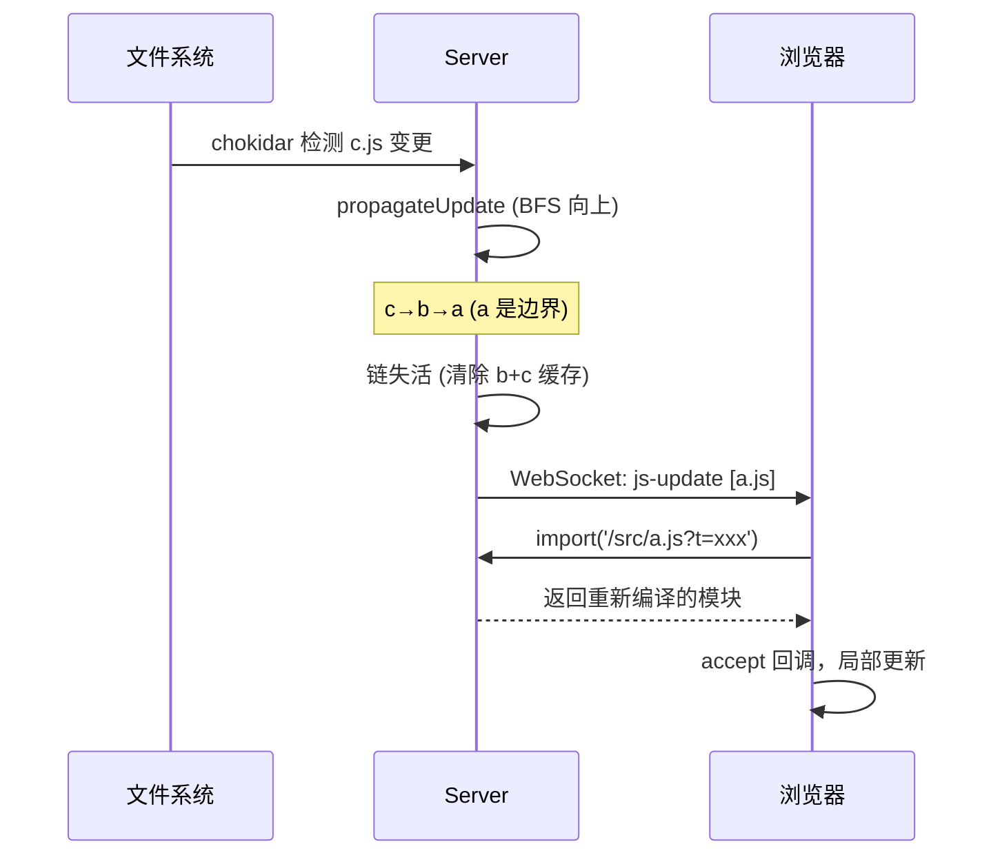
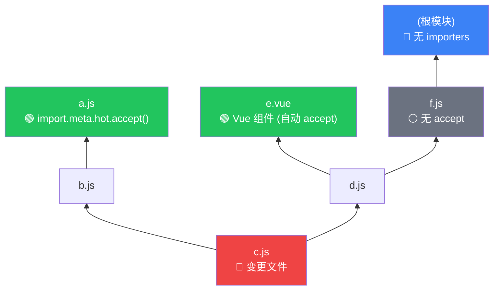
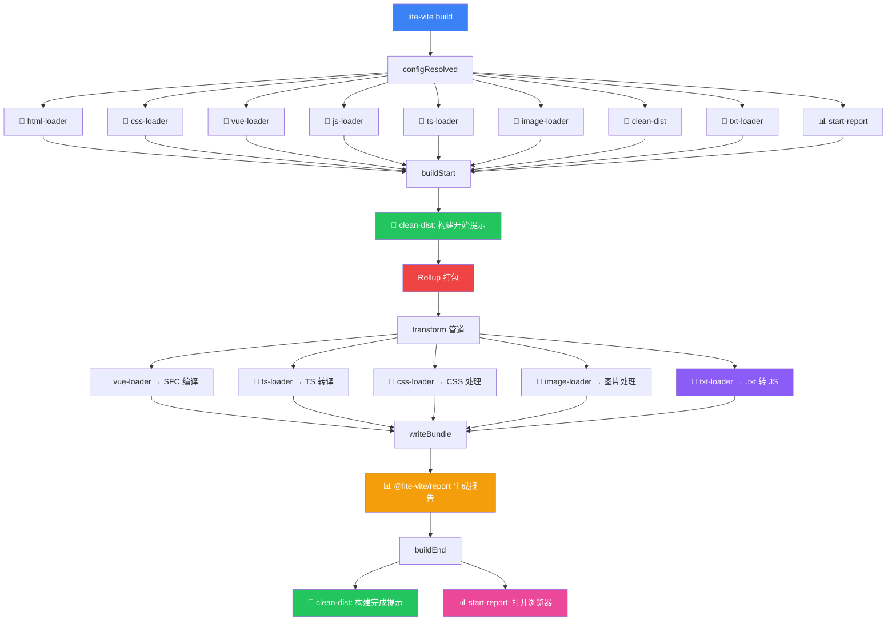

<style>
  .slidev-nav-controls-right,
  .slidev-layout-toc,
  .autocomplete-list,
  button[title="Table of Content"],
  button[title="目录"] {
    display: none !important;
  }
  .mermaid {
    max-height: 85vh;
    overflow: visible;
  }
  .mermaid svg {
    max-height: 80vh;
    max-width: 100%;
    height: auto !important;
  }
</style>

# Lite Vite

下一代轻量级前端构建工具

<div class="pt-12">
  <span class="px-2 py-1 rounded cursor-pointer" hover="bg-white bg-opacity-10">
    基于原生 ESM · 秒级启动 · 精准 HMR · 完整工具链
  </span>
</div>

<div class="abs-br m-6 flex gap-2">
  <a href="https://github.com/huanxiaomang/mini-vite" target="_blank" alt="GitHub" title="GitHub"
    class="text-xl slidev-icon-btn opacity-50 !border-none !hover:text-white">
    <carbon-logo-github />
  </a>
</div>

<!--
大家好，今天给大家介绍 Lite Vite，一个下一代轻量级前端构建工具。
-->

---
transition: fade-out
layout: center
---

# 前端构建的演进

<div class="text-xl text-gray-400 mt-4">
从刀耕火种到极速体验
</div>

---

# 传统构建工具的困境

以 webpack 为代表的打包器统治了前端工程化近十年，但痛点越来越明显：

<v-clicks>

- 🐌 **冷启动慢** — 项目越大启动越慢，中大型项目 30s~数分钟
- 🔄 **HMR 退化** — 热更新随模块数增长越来越慢，从 ms 退化到 s
- 📝 **配置地狱** — 一个项目需要十几个 loader + plugin，几十行配置
- 📦 **产物臃肿** — 自带模块运行时代码，tree-shaking 能力有限
- 🔧 **学习成本高** — loader/plugin/resolve/optimization/devServer...

</v-clicks>

<!--
webpack 的核心问题在于它的架构设计——开发阶段也要做全量打包。
-->

---
layout: two-cols
layoutClass: gap-16
---

# webpack 的工作方式



<div class="text-sm text-gray-400 mt-4">

项目越大 → 步骤 B~D 越慢 → 启动越慢

</div>

::right::

# Lite Vite 的工作方式



<div class="text-sm text-gray-400 mt-4">

启动速度与项目大小**无关** ⚡

</div>

<!--
左边是 webpack 的方式——先打包再启动。右边是 Lite Vite——先启动再按需编译。
-->

---
layout: center
class: text-center
---

# 核心优势

<div class="grid grid-cols-3 gap-8 mt-12">
  <div class="p-6 rounded-lg bg-blue-500/10">
    <div class="text-4xl mb-4">⚡</div>
    <div class="text-xl font-bold">秒级启动</div>
    <div class="text-sm text-gray-400 mt-2">不打包，直接启动服务器<br/>按需编译浏览器请求的模块</div>
  </div>
  <div class="p-6 rounded-lg bg-orange-500/10">
    <div class="text-4xl mb-4">🔥</div>
    <div class="text-xl font-bold">精准 HMR</div>
    <div class="text-sm text-gray-400 mt-2">模块依赖图 + BFS 传播<br/>只更新真正受影响的模块</div>
  </div>
  <div class="p-6 rounded-lg bg-green-500/10">
    <div class="text-4xl mb-4">📦</div>
    <div class="text-xl font-bold">极速预打包</div>
    <div class="text-sm text-gray-400 mt-2">esbuild 预编译依赖<br/>比 webpack DLL 快 10-100x</div>
  </div>
</div>

<div class="grid grid-cols-3 gap-8 mt-8">
  <div class="p-6 rounded-lg bg-purple-500/10">
    <div class="text-4xl mb-4">🛠️</div>
    <div class="text-xl font-bold">开箱即用</div>
    <div class="text-sm text-gray-400 mt-2">内置 TS / Vue / CSS / 图片<br/>零配置即可运行</div>
  </div>
  <div class="p-6 rounded-lg bg-cyan-500/10">
    <div class="text-4xl mb-4">🎯</div>
    <div class="text-xl font-bold">精简产物</div>
    <div class="text-sm text-gray-400 mt-2">Rollup 打包，天然 tree-shaking<br/>无运行时开销</div>
  </div>
  <div class="p-6 rounded-lg bg-pink-500/10">
    <div class="text-4xl mb-4">📊</div>
    <div class="text-xl font-bold">构建分析</div>
    <div class="text-sm text-gray-400 mt-2">内置可视化报告<br/>重复依赖检测 + 优化建议</div>
  </div>
</div>

---

# 与 webpack 全方位对比

| 维度 | webpack | Lite Vite |
|---|---|---|
| 开发启动 | 需全量打包，项目越大越慢 | **即时启动**，与项目大小无关 |
| 热更新 | 重新打包受影响 chunk，渐慢 | **模块级精准更新**，始终快速 |
| 配置 | 大量 loader/plugin 配置 | **零配置**，开箱即用 |
| TS 编译 | ts-loader（慢）/ babel（需配置） | **esbuild 即时转译**（极快） |
| CSS 处理 | css-loader + style-loader + mini-css-extract | **内置支持**，零依赖 |
| Vue 支持 | vue-loader + VueLoaderPlugin | **内置支持**，自动编译 |
| 图片处理 | file-loader / url-loader / asset module | **内置支持**，SVG 自动内联 |
| 产物质量 | 含模块运行时，tree-shaking 有限 | **Rollup 打包**，产物更精简 |
| 依赖处理 | DLL Plugin（手动配置） | **自动预打包**，esbuild 极速 |

---

# 与现代工具的差异化

Lite Vite 不只是一个打包器，而是**完整的前端工具链**。

<div class="grid grid-cols-2 gap-8 mt-6">

<div>

### Rollup / esbuild / unbuild

<v-clicks>

- ✅ 优秀的库打包工具
- ❌ 没有开发服务器
- ❌ 没有 HMR
- ❌ 没有依赖预打包
- ❌ 没有 Vue SFC 编译
- ❌ 没有项目脚手架
- ❌ 没有构建分析报告

</v-clicks>

<div class="text-sm text-gray-400 mt-4">

→ 它们是**单一工具**，需要自己组合

</div>

</div>

<div>

### Lite Vite 工具链

<v-clicks>

- ✅ 开发服务器（按需编译 + HMR）
- ✅ 生产构建（Rollup 打包）
- ✅ 依赖预打包（esbuild）
- ✅ Vue / TS / CSS / 图片（内置）
- ✅ 项目脚手架（create-lite-vite）
- ✅ 构建分析（@lite-vite/report）
- ✅ 插件系统（统一 API）
- ✅ ESLint 预设（@lite-vite/eslint-config）

</v-clicks>

<div class="text-sm text-gray-400 mt-4">

→ **一站式解决方案**，从创建到部署

</div>

</div>

</div>

<!--
Rollup、esbuild、unbuild 都是优秀的打包工具，但它们只是工具链中的一环。Lite Vite 提供的是完整的开发体验。
-->

---
layout: center
class: text-center
---

# 工具链全景

<div class="text-xl text-gray-400 mb-8">
一个命令创建，一个命令开发，一个命令构建，一个命令分析
</div>

```
pnpm create lite-vite   →   pnpm dev   →   pnpm build   →   pnpm report
     🏗️ 创建项目              ⚡ 开发          🎯 构建          📊 分析
```

---

# Monorepo 架构

<div class="mt-4"></div>



---

# 开发服务器架构

<div class="grid grid-cols-[1fr_60px_1fr] gap-0 mt-2 text-sm">

<div class="p-4 rounded-lg bg-blue-500/10">
<div class="text-lg font-bold mb-3">🌐 浏览器</div>

- `<script type="module">` 发起请求
- 原生 ESM 逐一加载依赖
- HMR Client（WebSocket）
- `updateStyle` / `removeStyle`
- `import(url + '?t=timestamp')` 热更新

</div>

<div class="flex items-center justify-center text-2xl">⇄</div>

<div class="p-4 rounded-lg bg-red-500/10">
<div class="text-lg font-bold mb-3">⚡ Dev Server</div>

**请求拦截 → 按需编译 → 返回**

| 请求 | 处理 |
|---|---|
| `.html` | 注入 HMR 客户端脚本 |
| `.ts/.tsx` | esbuild 即时转译 |
| `.vue` | @vue/compiler-sfc 编译 |
| `.css?import` | 转为 JS 模块 |
| `.png/.svg` | 路径引用 / data URI |
| 裸模块 `vue` | 返回 esbuild 预打包结果 |

</div>

</div>

<div class="grid grid-cols-3 gap-3 mt-4 text-xs">
<div class="p-2 rounded bg-green-500/10 text-center">📦 依赖预打包<br/><span class="text-gray-400">esbuild → .lite-vite/</span></div>
<div class="p-2 rounded bg-purple-500/10 text-center">🔗 模块依赖图<br/><span class="text-gray-400">双向链接 + BFS</span></div>
<div class="p-2 rounded bg-orange-500/10 text-center">🔥 HMR 服务<br/><span class="text-gray-400">WebSocket + chokidar</span></div>
</div>

---

# HMR 更新链路



---

# HMR 边界查找

模块依赖图中的 **BFS 向上传播**算法：



<div class="grid grid-cols-3 gap-4 mt-4 text-sm">

<div class="p-3 rounded bg-green-500/10">

**找到边界 → 局部更新**

c→b→**a** (self-accepting)
c→d→**e** (Vue 组件)

</div>

<div class="p-3 rounded bg-red-500/10">

**无边界 → 全页面刷新**

c→d→f→根 (无 accept)

</div>

<div class="p-3 rounded bg-blue-500/10">

**边界类型**

- `import.meta.hot.accept()`
- Vue SFC（自动注入）
- CSS 模块（自动注入）

</div>

</div>

---

# 插件系统

简洁统一的 API，一份代码同时服务开发和构建：

````md magic-move
```ts
// 最小插件
const myPlugin = {
  name: 'my-plugin',
}
```

```ts
// 生命周期钩子
const myPlugin = {
  name: 'my-plugin',
  configResolved(config) { /* 配置就绪 */ },
  buildStart() { /* 构建开始 */ },
  buildEnd() { /* 构建结束 */ },
}
```

```ts
// transform 钩子：自定义文件类型处理
const txtLoader = {
  name: 'txt-loader',
  async transform(content, filePath) {
    if (!filePath.endsWith('.txt')) return null
    return {
      code: `export default ${JSON.stringify(content)}`,
      mimeType: 'application/javascript',
      map: null,
    }
  },
}
```

```ts
// 完整插件：构建后自动打开报告
const startReport = {
  name: 'start-report',
  buildEnd() {
    const report = join(process.cwd(), 'dist/build-report.html')
    if (existsSync(report)) {
      exec(`open ${report}`)
    }
  },
}
```
````

---

# 插件执行流程

构建模式下，内置插件与用户插件的完整钩子调用时序：



---

# 构建分析报告

每次 `lite-vite build` 自动生成可视化 HTML 报告：

<div class="grid grid-cols-2 gap-6 mt-6">

<div>

### 报告内容

<v-clicks>

- 📏 **总览面板** — 构建时间、总体积、文件/模块数
- 📊 **体积分类** — JS / CSS / 图片 / 字体占比
- 🔍 **模块分析** — 每个 chunk 的模块组成
- ⚠️ **重复依赖检测** — 自动发现浪费的体积
- 🌐 **网络模拟** — 5G/4G/3G/2G 加载时间
- 📈 **构建历史** — 体积趋势 + 版本 diff
- 💡 **优化建议** — 针对性改进方案

</v-clicks>

</div>

<div>

### 独立使用

```bash
# 构建后自动生成
lite-vite build
# 📊 构建报告: dist/build-report.html

# 独立分析任意目录
lite-vite report
# 扫描 dist/ → 生成报告 → 打开浏览器

# 也可以用独立 CLI
npx lite-report dist
```

</div>

</div>

---

# Vue SFC 支持

内置 `@vue/compiler-sfc`，无需额外配置：

<div class="grid grid-cols-2 gap-6 mt-4">

<div>

### 支持特性

<v-clicks>

- ✅ `<script setup>` 语法糖
- ✅ Scoped CSS 样式隔离
- ✅ Template 编译为渲染函数
- ✅ 组件级 HMR（rerender / reload）

</v-clicks>

</div>

<div>

### HMR 智能判定

| 变更位置 | 更新策略 | 状态保留 |
|---|---|---|
| `<template>` | rerender | ✅ 保留 |
| `<script>` | reload | ❌ 重置 |
| `<style>` 内容 | CSS 热替换 | ✅ 保留 |
| `<style>` 增删 | reload | ❌ 重置 |

</div>

</div>

<div class="mt-6">

```vue
<script setup lang="ts">
import { ref } from 'vue'
const count = ref(0)
</script>

<template>
  <button @click="count++">{{ count }}</button>
</template>

<style scoped>
button { padding: 8px 16px; }
</style>
```

</div>

---
layout: two-cols
layoutClass: gap-16
---

# 快速上手

## 创建项目

```bash
pnpm create lite-vite@latest
```

选择模板：
- `vanilla-js-template`
- `vue3-ts-template`

## 开发

```bash
pnpm dev
# Server running at http://localhost:4000
```

## 构建

```bash
pnpm build
# ✓ Built in 2.35s
# 📊 构建报告: dist/build-report.html
```

::right::

## 配置文件

```ts
// lite.config.ts
import { defineLiteConfig } from 'lite-vite'

export default defineLiteConfig({
  server: {
    port: 3000,
    open: true,
  },
  build: {
    minify: true,
    sourcemap: true,
  },
  plugins: [
    cleanDist(),
    txtLoader(),
    startReport(),
  ],
})
```

<div class="text-sm text-gray-400 mt-4">

大部分场景下零配置即可运行

</div>

---
layout: center
class: text-center
---

# 总结

<div class="grid grid-cols-2 gap-12 mt-8 text-left">

<div>

### 告别 webpack 时代

<div class="text-sm text-gray-400 space-y-2 mt-4">

- ❌ 漫长的冷启动等待
- ❌ 越来越慢的 HMR
- ❌ 几十行 loader/plugin 配置
- ❌ 臃肿的产物体积
- ❌ 分散的工具链拼装

</div>

</div>

<div>

### 拥抱 Lite Vite

<div class="text-sm text-gray-400 space-y-2 mt-4">

- ⚡ 秒级启动，极速开发
- 🔥 模块级精准 HMR
- 🛠️ 零配置，开箱即用
- 🎯 Rollup 精简产物
- 📦 一站式完整工具链

</div>

</div>

</div>

<div class="mt-12 text-2xl">

```bash
pnpm create lite-vite@latest
```

</div>

---
layout: end
---

# Thanks

<div class="text-gray-400 mt-4">

[GitHub](https://github.com/huanxiaomang/mini-vite) · [文档](https://lite-vite.netlify.app) · 欢迎 Star ⭐

</div>
